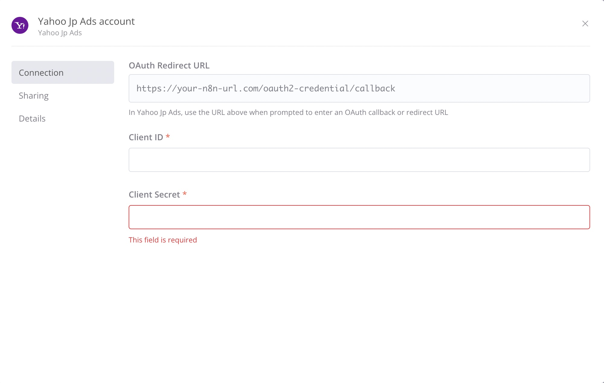

# n8n-nodes-yahoo-jp-api-search-ads

Yahoo JP API Search ads - custom node for interacting with YahooJP API Search ads.

Yahoo JP uses custom oAuth2 implementation (refresh token via HTTP via GET with QS parameters).

## Usage

First of all you need to request access to yahoo api (https://ads-developers.yahoo.co.jp/developercenter/en/startup-guide/apply-api-use.html), it takes 5-10 min to have API access.

Then request API `Client ID` and `Client Secret` from (https://connect-business.yahoo.co.jp/cooperation/), and configure the credentials.

## Resources

This plugin only has one resource:

- Upload offline conversions -- it takes a binary (binary property), account Id and upload file name [Documentation URL](https://ads-developers.yahoo.co.jp/reference/ads-search-api/v8/OfflineConversionService/upload/en/).
## License

[MIT](https://github.com/leadtechcorp/n8n-nodes-yahoo-jp-api-search-ads/blob/master/LICENSE.md)
